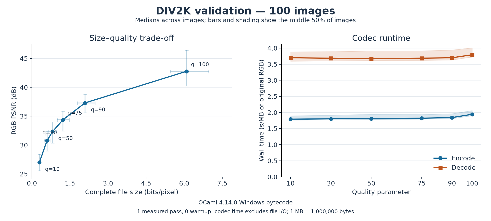

# MyImageCompressor

A JPEG-inspired image compressor written in OCaml as a personal scientific
project. I built it to study how frequency transforms, quantization and entropy
coding turn an image into a smaller representation, and how compression affects
visual quality.

The numerical core includes a recursive Cooley–Tukey FFT used to compute the
2D discrete cosine transform (DCT) and its inverse. The complete encoder and
decoder combine color conversion, 4:2:0 chroma subsampling, 8×8 block transforms,
quantization, zigzag traversal, differential DC coding and Huffman coding.
Direct transform formulas and automated regression tests validate the implementation.

## Visual example

Original photograph and reconstructions at qualities 10, 50 and 90:


The same region around the lion's eye, enlarged equally to reveal compression artifacts:


The image is `0809.png` from [DIV2K](https://data.vision.ee.ethz.ch/cvl/DIV2K/).
Compression uses the full original resolution; resizing and enlargement are only
for display. The bpp and PSNR labels refer to the whole image.
See [image attribution](docs/image-attribution.md).

## Benchmark results

All **100 DIV2K validation images**, at their original resolution, were tested
at six quality settings: **600 encode/decode measurements**.



| Quality | File bits/pixel | Compression ratio | RGB PSNR (dB) | OJPG / PNG size |
| ---: | ---: | ---: | ---: | ---: |
| 10 | 0.30 | 81.0× | 27.0 | 2.4% |
| 30 | 0.59 | 40.4× | 30.8 | 4.9% |
| 50 | 0.81 | 29.5× | 32.3 | 6.6% |
| 75 | 1.23 | 19.6× | 34.4 | 9.9% |
| 90 | 2.10 | 11.5× | 37.3 | 17.0% |
| 100 | 6.09 | 3.9× | 42.8 | 49.1% |

Values are **medians across images**. File size includes the container header;
compression ratios compare against uncompressed 24-bit RGB, rather than PNG.
The last column is the median of `100 × OJPG bytes / original PNG bytes`:
lower is smaller. The original PNGs are lossless; OJPG is lossy.
At quality 75, the median ratio is **19.6×** with **34.4 dB** PSNR. From quality
90 to 100, the median file size grows roughly **2.9×** for a **5.5 dB** PSNR gain.

Median encoding time ranges from **1.79 to 1.94 s/MB**, and decoding from
**3.67 to 3.79 s/MB**. These are OCaml 4.14.0 **bytecode** measurements on
Windows 11, with one measured pass and no warmup. The plotted spread describes
differences between images, not timing uncertainty across repeated runs.
See the [raw results](benchmarks/div2k-100.csv),
[run metadata](benchmarks/div2k-100.json) and [methodology](docs/benchmarks.md).

## Build and use

Requires OCaml 4.14 or later and Dune 3 or later.

```sh
opam install dune
opam exec -- dune build
opam exec -- dune runtest
opam exec -- dune exec bin/main.exe -- compress input.ppm output.ojpg --quality 75
opam exec -- dune exec bin/main.exe -- decompress output.ojpg reconstructed.ppm
```

Input images are binary PPM (P6, 8-bit RGB). Quality ranges from 1 to 100;
even quality 100 remains lossy because of chroma subsampling and rounding.
PNG conversion and alternative build instructions are in the
[usage guide](docs/usage.md).

The custom `.ojpg` format is inspired by JPEG but is not JPEG/JFIF compatible.
Decode it to PPM to view the result.

## Implementation

The main modules are [`dct.ml`](src/dct.ml) for the transforms,
[`codec.ml`](src/codec.ml) for the image pipeline,
[`entropy.ml`](src/entropy.ml) for coefficient coding, and
[`container.ml`](src/container.ml) for file storage.
See the [transform explanation](docs/transforms.md) and
[file format specification](docs/format.md) for details.

## Scope and possible extensions

This project is complete. The implementation uses fixed coding tables,
nearest-neighbor chroma reconstruction and a single-threaded pipeline.
Possible extensions include comparing 4:4:4 and 4:2:0 subsampling, profiling
native execution, measuring memory use, or comparing rate–distortion with a
standard JPEG encoder. These are exploration ideas, with no further work
currently planned.

## License

The source code is released under the [MIT License](LICENSE).
The DIV2K photographs retain their separate usage conditions, described in
[image attribution](docs/image-attribution.md).
