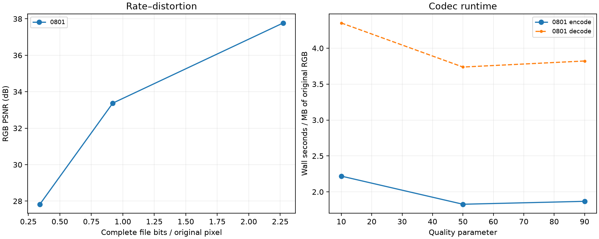
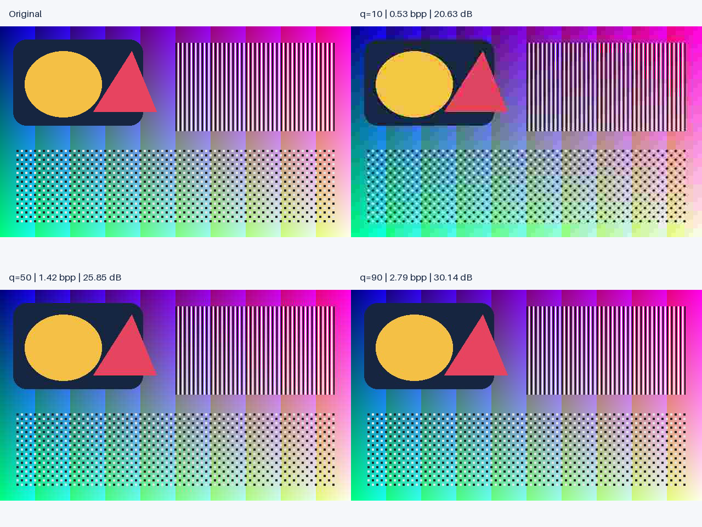

# JPEG-like Image Compressor in OCaml

A lossy image compression pipeline built from first principles during a TIPE
project, including a recursive Cooley–Tukey FFT adapted to compute the 2D DCT.
The encoder and decoder implement color conversion, 4:2:0 chroma subsampling,
8×8 block transforms, quantization, zigzag traversal, zero-run coding and fixed
Huffman coding.

The purpose is to understand how mathematical transforms and entropy coding
work together, and to measure the trade-off between reconstruction quality,
storage and computation. The numerical core is written in OCaml using its
standard library; Python is used only for dataset conversion and presentation.


The photograph is `0809.png` from
[DIV2K](https://data.vision.ee.ethz.ch/cvl/DIV2K/). Each reconstruction was
compressed at the original resolution, saved to disk, read back and decoded by
the OCaml program. Bits per pixel include the complete compressed file; PSNR
is measured over the full original RGB image. Previews are resized for display.
The yellow rectangle marks the detail shown below. Photo rights remain with
the original owner; see [image attribution](docs/image-attribution.md).

<details>
<summary>Inspect the same detail at each quality</summary>


The detail is enlarged with nearest-neighbor sampling to make compression
artifacts visible. Its labels report the full-image metrics, not crop metrics.

</details>

To reproduce this example after obtaining the dataset:

```sh
python scripts/make_photo_demo.py data/DIV2K_valid_HR/0809.png --crop 760 300 1080 620
```

## What this project demonstrates

- Implementing a radix-2 FFT and deriving a normalized 2D DCT and its inverse.
- Combining lossy stages with exactly reversible coefficient coding.
- Understanding the contribution of quantization and chroma subsampling.
- Checking numerical algorithms against direct, independent reference formulas.
- Producing reproducible rate–distortion and runtime measurements.

This is **JPEG-like**, not a JPEG/JFIF implementation. Its `.ojpg` files use a
small custom container and cannot be opened by an ordinary JPEG viewer. Decode
them to PPM first. There is no claim of compatibility or performance parity
with production JPEG libraries.

## Build and run

Use OCaml 4.14 or later and Dune 3 or later. See the
[official OCaml installation instructions](https://ocaml.org/docs/installing-ocaml).
The included CI configuration targets OCaml 4.14 and 5.3; local verification
was performed with OCaml 4.14.0 bytecode on Windows.

```sh
opam install dune
opam exec -- dune build
opam exec -- dune runtest
opam exec -- dune exec bin/main.exe -- --help
```

With the OCaml environment already active:

```sh
dune exec bin/main.exe -- compress input.ppm output.ojpg --quality 75
dune exec bin/main.exe -- decompress output.ojpg reconstructed.ppm
```

Quality is an integer from 1 to 100. Even quality 100 is generally lossy:
4:2:0 subsampling and coefficient rounding remain active.

Inputs are binary PPM P6 images with maximum sample value 255. Images need not
be square or a multiple of the block size. The encoder replicates the final
row/column to a multiple of 16, and the decoder restores the original dimensions.
The current implementation accepts at most 16,777,216 source pixels.

If Dune is unavailable, a Python build helper can compile the same sources:

```sh
python scripts/build.py --compiler ocamlc --test
python scripts/build.py --compiler ocamlopt --test
```

These produce `_build/bytecode/jpeg-like.exe` or
`_build/native/jpeg-like.exe`. The `.exe` name is used consistently on all
platforms. Bytecode requires a working `ocamlrun`; native builds require the
platform's OCaml C toolchain. The helper also accepts an absolute compiler path.

On the original Windows workspace, the portable compiler resides outside the
repository, in the sibling `.tools` directory. No global opam installation is
required to compile and run the regression tests there:

```powershell
powershell -NoProfile -ExecutionPolicy Bypass -File scripts/test_windows.ps1
```

The helper detects the local compiler and Python runtime and rebuilds the tests
from the current source. The execution-policy option applies only to that
PowerShell process. In another checkout, install OCaml and Python first, or
provide their executable paths using `-CompilerPath` and `-PythonPath`. This
local bytecode helper does not install opam or a native C toolchain.

## PNG inputs and the dataset

The historical OCaml source does not implement PNG decoding. This repository
provides a separate conversion step using Pillow:

```sh
python -m pip install -r scripts/requirements.txt
python scripts/prepare_dataset.py path/to/DIV2K_valid_HR data/div2k-ppm
```

The script preserves dimensions, converts to 8-bit RGB and writes a manifest
with source/output hashes. It does not resize, crop or apply color-profile
conversion. Transparent images require an explicit background choice and are
rejected. For a quick experiment, add `--limit 3`.

Obtain DIV2K validation images from the
[official dataset page](https://data.vision.ee.ethz.ch/cvl/DIV2K/).
The images are not included in this repository. Dataset authors restrict
availability to academic research and retain the original image owners'
copyright; see their terms and requested citations.

## Benchmarks

The OCaml benchmark reports per-image measurements directly:

```sh
dune exec bin/main.exe -- benchmark data/div2k-ppm/0801.ppm --qualities 10,50,90 --csv results.csv
```

For directories and machine/build metadata, use the Python runner:

```sh
python scripts/run_benchmarks.py data/div2k-ppm --qualities 10,30,50,75,90,100 --build-label "OCaml VERSION native, compiler default optimization"
python scripts/plot_benchmarks.py results/benchmark.csv
```

Replace `VERSION` with the actual compiler version. The runner defaults to
Dune's `_build/default/bin/main.exe`; supply `--exe` for another build and
`--runtime path/to/ocamlrun` if a relocated bytecode launcher needs it.
All output directories must be writable; the runner creates the parent of its
CSV and refuses to overwrite existing results.

In the original Windows workspace, use the PowerShell helper from the repository
directory. It rebuilds the codec, detects the compiler and Python paths, and
records the actual compiler version and build type automatically:

```powershell
# Try one image first, saving to a separate file.
powershell -NoProfile -ExecutionPolicy Bypass -File scripts/benchmark_windows.ps1 -Limit 1 -Output results/essai.csv
# All prepared images, six qualities, one measured pass and no warmup.
powershell -NoProfile -ExecutionPolicy Bypass -File scripts/benchmark_windows.ps1
```

The full run writes `results/div2k-100.csv` and matching `.json` metadata. The
default input is `data/div2k-ppm`; if it contains no PPM images, the helper can
convert the original sibling `final` dataset using Pillow. Use `-ImagesDirectory`
for another PPM directory, `-Qualities` to choose qualities, and `-Output` for a
new result filename. The portable compiler produces bytecode, so the full
100-image run can take several hours. Keep the computer awake during the run.

| Metric | Definition |
| --- | --- |
| Payload bpp | Valid Y, Cb and Cr entropy bits / original pixel count |
| File bpp | Complete `.ojpg` file bytes × 8 / original pixel count |
| Compression ratio | Original RGB raster bytes / complete `.ojpg` bytes |
| Space saving | 100 × (1 − compressed file bytes / original RGB raster bytes) |
| PSNR | 10 log10(255² / MSE), over all original RGB samples |
| CPU/wall seconds | Time spent inside encode/decode, reported separately |
| Seconds/MB | Codec time / original RGB raster size in decimal MB |
| MB/s | Original RGB raster size in decimal MB / codec wall time |

The reference size is **3 × width × height bytes**, not the PNG file size or
the PPM header. MB means 1,000,000 bytes, not MiB. File size includes the 28-byte
container header and each stream's last padded byte. PSNR compares the original
dimensions, including border pixels; identical images produce infinity.

By default each image/quality has **one measured pass and no warmup**. That pass
supplies both image metrics and timings. For a more stable timing study, add
`--warmup 1 --repeat 3`: one unmeasured warmup followed by three measured passes.
The CSV records repeats and warmup runs. Times are the single measured value
when repeats=1, otherwise medians. Input parsing, PNG conversion, disk I/O, PSNR and
explicit garbage collection before each measured run are excluded. Allocations
and garbage collection occurring **inside** encode/decode are included. Encode
includes entropy packing; decode includes entropy reading. The runner records
input hashes, platform information, build label and executable hash.

Checked-in CSVs and metadata in [`benchmarks/`](benchmarks/) are actual local
measurements, not performance targets. The DIV2K result is a **single-image
execution check**, with one measured run per quality after warmup. It does not
represent the full 100-image validation set, and Windows bytecode timing should
not be compared to native-code JPEG libraries. A larger experiment should use
native compilation, multiple measured runs and all images.



The original naive algorithms are also useful baselines:

```sh
dune exec bin/main.exe -- transforms --repeat 50 --max-power 6 --csv transforms.csv
```

This compares FFT versus direct DFT, and FFT-based DCT versus the direct cosine
sum, reporting both time and maximum absolute error. Approximate floating-point
agreement is checked; exact floating-point equality is not assumed. Each
algorithm is batched for at least 0.2 elapsed seconds to reduce clock-resolution
effects. Transform speedup uses wall time per batch; CPU times are also retained.

## Code map

| File | Responsibility |
| --- | --- |
| `src/dct.ml` | Original FFT and FFT-based DCT/IDCT; alternate 4N DCT construction |
| `src/reference.ml` | Direct normalized cosine-sum DCT for validation |
| `src/tables.ml` | Fixed quantization and Huffman tables |
| `src/entropy.ml` | Zigzag, differential DC, zero-run AC, sparse Huffman trees |
| `src/bits.ml` | Packed bit writing/reading and exact bit lengths |
| `src/codec.ml` | Edge padding, 4:2:0 planes, block processing and reconstruction |
| `src/container.ml` | Versioned `.ojpg` binary format |
| `src/image.ml` | PPM I/O, dimensions and RGB PSNR |
| `bin/main.ml` | Compression, decompression and benchmarks |
| `test/test_codec.ml` | Numerical, entropy, file and image regression tests |

See [the transform explanation](docs/transforms.md),
[the file format](docs/format.md), and
[the French migration notes](docs/PORTAGE.md).
Executed checks and their limits are recorded in
[the local validation report](docs/VALIDATION.md).

## Synthetic stress image



This complementary illustration is generated by `scripts/make_demo.py`. It
combines smooth gradients, sharp color edges and fine patterns to reveal
different compression artifacts. It is a deliberately synthetic stress image,
not a claim about typical photographic performance. Each reconstruction is
also saved and read back through the file-based codec.

## Limitations and next experiments

The pipeline uses fixed tables, nearest-neighbor chroma reconstruction and
whole-image color planes. It is single-threaded and is intended for experiments,
not untrusted large-file services. The container detects inconsistent lengths
and invalid coding but has no checksum: a syntactically valid bit change may
alter an image without being detected.

Useful next experiments include native profiling, comparing 4:4:4 with 4:2:0,
comparing rate–distortion against a standard JPEG encoder under documented
settings, and measuring peak memory. None of these comparisons is claimed yet.

The original TIPE numerical work is retained; portability, file storage,
automated regression checks and benchmark tooling were added during repository
preparation. The original local files remain separate from this repository.

## Publication

Upload this directory's source, documentation, examples and measured CSVs.
Do not upload `_build/`, `data/`, `results/`, the portable compiler or the
historical working directory. They are excluded from this repository or Git.
The full DIV2K dataset is not included. The photographic documentation example
is attributed separately from the locally generated synthetic illustration.
A software license has not yet been selected; add one before
inviting reuse of the code.

## References

- [DIV2K dataset and citation information](https://data.vision.ee.ethz.ch/cvl/DIV2K/):
  Eirikur Agustsson and Radu Timofte, *NTIRE 2017 Challenge on Single Image
  Super-Resolution: Dataset and Study*, CVPR Workshops, 2017.
- Radu Timofte et al., *NTIRE 2017 Challenge on Single Image Super-Resolution:
  Methods and Results*, CVPR Workshops, 2017.
